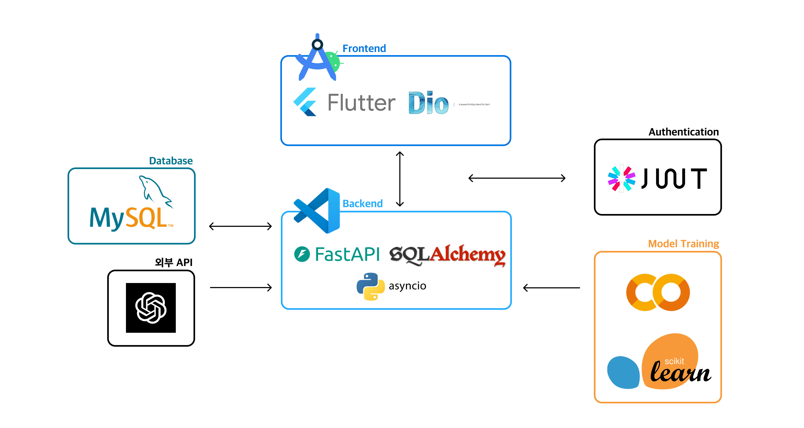
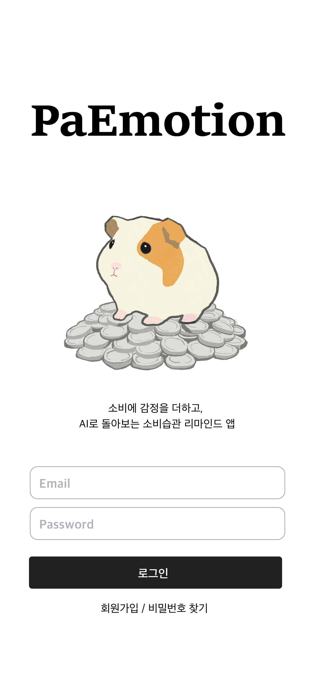
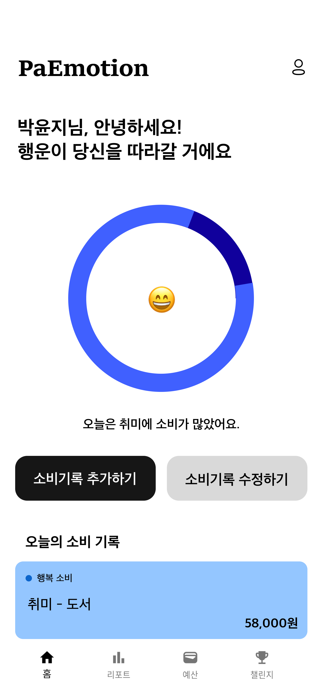
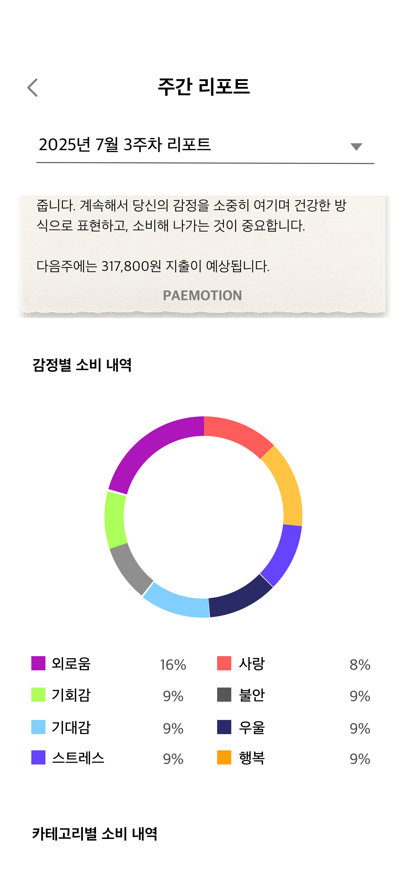
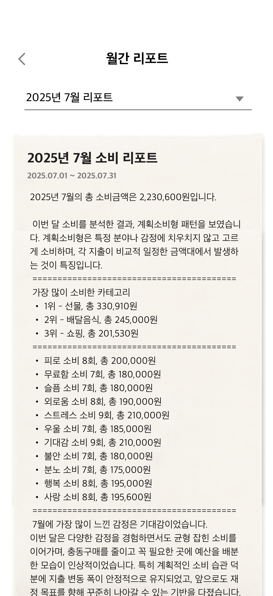
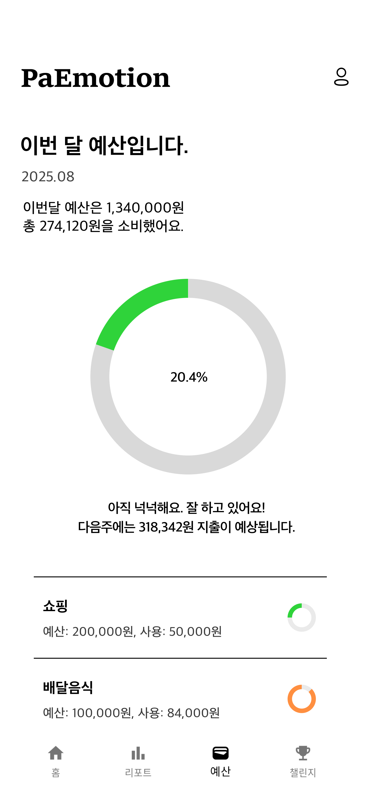
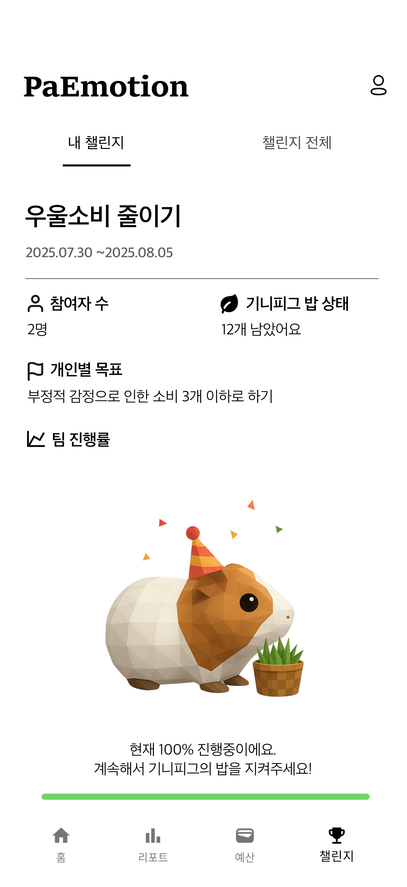

  

# 소비에 감정을 더하고, AI로 돌아보는 소비습관 리마인드 앱
## 감정 기반 소비 기록 + 지출 예측 + 챌린지로 습관 교정까지!

  
## 🔍 프로젝트 소개
**PaEmotion**은 감정과 소비 패턴을 통합 분석해, AI 맞춤 코칭으로 현명한 소비 습관 형성을 돕는 감정 인식 가계부 앱입니다. 
단순한 지출 기록을 넘어, 소비와 감정을 연결해 사용자가 자신의 습관을 직관적으로 이해하고 개선할 수 있도록 지원합니다.

  
## 📌 프로젝트 개요
- ### 팀 구성
    - Frontend 1명 · Backend 2명
- ### 목표 
    - 즉흥적·감정적 소비 인지 & 개선 유도
    - 소비-감정 관계를 AI로 분석하고 맞춤 피드백 제공
    - 예측 모델로 미래 지출 경향 점검 및 조절
- ### 주요 기능
    - **AI 리포트 제공** — 사용자의 소비와 감정을 분석하여 개인 맞춤 인사이트 제공
    - **소비 유형 분석** — 소비 기록을 기반으로 사용자의 주요 소비 특징을 파악하고 소비 유형 진단
    - **다음주 지출 예측** — 과거 데이터를 토대로 다음 주 지출을 예측하여 계획적인 소비 지원
    - **맞춤형 예산 설정** — 개인 상황과 목표에 맞추어 카테고리별로 예산을 설정하고 관리
    - **소비 습관 훈련 챌린지** — 목표 기반 챌린지를 통해 사용자가 점진적으로 건강한 소비 습관을 형성하도록 도움

  
## 👩‍💻 팀원 소개
- **김도윤(팀장) :** AI, Backend
- **박예린 :** Backend
- **김시연 :** Design, Frontend

  
## 🏗️ 개발 아키텍처

  
## 🔗 ERD

  
## 🛠 기술 스택
### Backend

### Frontend

### AI & Model

### Tools & Infra

  
## 🤖 AI & 머신러닝
| 기술 | 역할 |
| --- | --- |
| **OpenAI GPT API** | 소비·감정 기반 리포트 생성 |
| **Random Forest Regression** | 다음 주 지출 예측 |
| **Random Forest Classification** | 소비 성향 분석 |

  
## 📋 개발 기간 및 작업 관리
### 개발 기간
- 개발 기간 : 2025-06-30 ~ 2025-08-10
### 작업 관리
- GitHub Projects와 Issues를 사용하여 개발 진행 상황 공유
- 주간회의를 진행하며 작업 순서와 방향성에 대한 고민을 나누고 Notion을 통해 전체적인 진행 상황 공유

  
## 📜 컨벤션 전략
### [ 브랜치 컨벤션 ]
- Git-flow 전략을 기반으로 main, develop 브랜치와 feature 보조 브랜치 운용
- main, develop, Feat 브랜치로 나누어 개발 진행
- main : 배포 단계에서만 사용
- develop : 개발 단계에서 git-flow의 master 역할
- Feat : 기능 단위로 독립적인 개발 환경을 위하여 사용 후 develop으로 merge
  
### [ PR 컨벤션 ]
- [Issue 종류] 구현내용 #이슈_번호
- ex) [Feature] 로그인 #1
- Back : Pull Request만 날리고, Approve는 reviewer 담당 / Front : 독립적 합병

### [ 커밋 컨벤션 ]
- [Issue 종류] 구현내용
- ex) [Feature] 소비내역 생성 API 구현

  
## 📱 어플 실행 화면
<table>
  <tr>
    <td align="center">
      <b>로그인 화면</b> 
      
    </td>
    <td align="center">
      <b>홈 화면</b> 
      
    </td>
  </tr>
  <tr>
    <td align="center">
      <b>주간 리포트 화면</b> 
      
    </td>
    <td align="center">
      <b>월간 리포트 화면</b> 
      
    </td>
  </tr>
  <tr>
    <td align="center">
      <b>예산 현황 화면</b> 
      
    </td>
    <td align="center">
      <b>참여 중인 챌린지 화면</b> 
      
    </td>
  </tr>
</table>

